# AWS: fundamentos, EC2, S3, VPC y RDS

## Objetivo

- Lanzar y asegurar una EC2, instalarle Java y correr ahí el jar de taskflow-api
- Usar S3: un bucket privado.
- Crear un RDS PostgreSQL que solo acepta conexiones desde la EC2 creada, y conectar la API cambiando solo variables de entorno.

## Contenido de `taskflow-api`
- Controladores REST
- Manejo del repositorio con JPA / Spring Data
- Seguridad con JWT

## Presupuesto
Se creo un budget con limite mensual de $5 dolares, envia una notificación por correo cuando el gasto se acerca o supera ese limite.

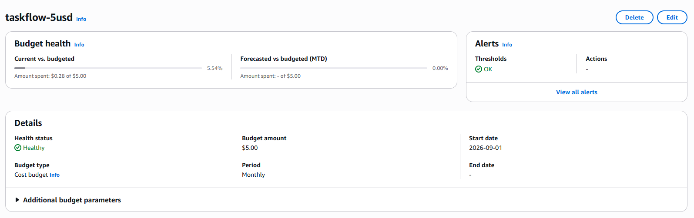

## Asegurar la cuenta
Se creo un usuario `IAM`. Se considera una buena práctica usar una cuenta IAM y no una `root` porque la ultima tiene el poder absoluto sobre la cuenta de AWS. Si la cuenta root fuera comprometida por alguna razón, perderíamos el acceso de forma permanente a la cuenta AWS, con un usuario `IAM` se puede revocar/eliminar sin afectar la cuenta raíz, además podemos ajustar permisos. El usuario `IAM` es el que se utiliza día a día.

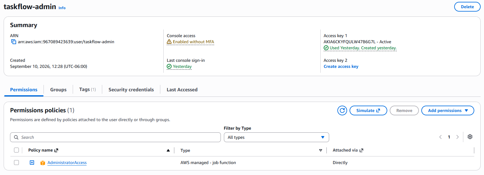

## Lanzar la EC2
Se crea una instancia EC2 siguiendo la ruta: Barra de búsqueda → `EC2` → en el menú izquierdo Instances  botón naranja Launch instances. Se llena la información del formulario con la configuración de la instancia:
- Name and tags: Name: `taskflow-ec2`. Es el nombre de la instancia.
- Application and OS Images (Amazon Machine Image): Amazon Linux 2023 AMI. Una AMI contiene el sistema operativo, servidor de aplicaciones y aplicaciones que usara la instancia.
- Instance type: `t3.micro`. Es la maquina donde correra la instancia, en este caso elegimos la más basica.
- Key pair (login): Se crea un archivo `.pem` que nos servira como llave privada SSH, permite que nos conectemos de forma segura a la instancia EC2 mediante SSH. Crea una llave pública que AWS guarda e instala automáticamente en la instancia EC2 y una llave privada (.pem) que se descarga en la computadora personal.

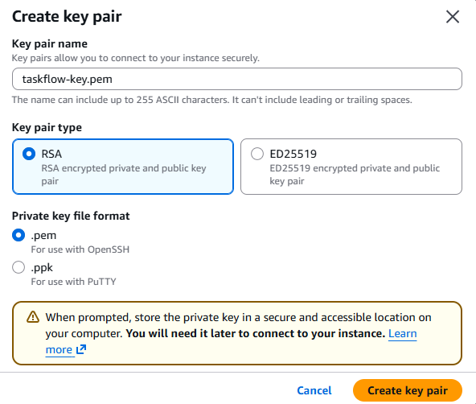

- Network settings: Creamos un security group con una regla de tipo SSH con un source type de My Ip y otra de tipo Custom TCP. De esta forma solo mi ip podrá conectarse a la instancia EC2 mediante SSH y todo el mundo podrá acceder al puerto 8080. Si en el source type de SSH hubiera elegido Anywhere (0.0.0.0/0) en lugar de My Ip, la puerta de mi instancia hubiera quedado abierta a cualquier IP de Internet y eso significa estar expuesto a ataques automatizados.

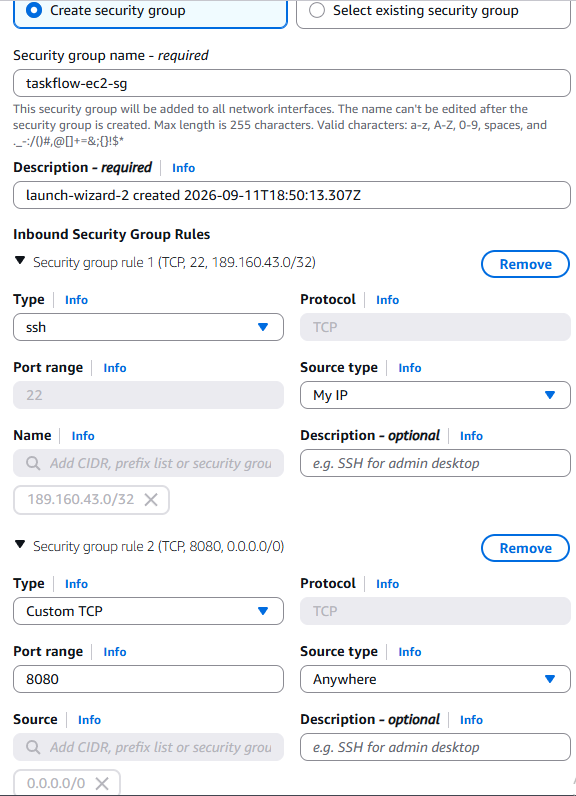

- Configure storage: 8 GiB gp3. Es la capacidad y tipo de almacenamiento que tendrá la instancia.

Una vez creada la instancia, al darle click podremos ver la información que configuramos. La public IPv4 address nos servira al momento de conectarnos a la instancia mediante SSH, esta cambia cada vez que detenemos y volvemos a iniciar la instancia por lo que hay que estar al tanto de esto.

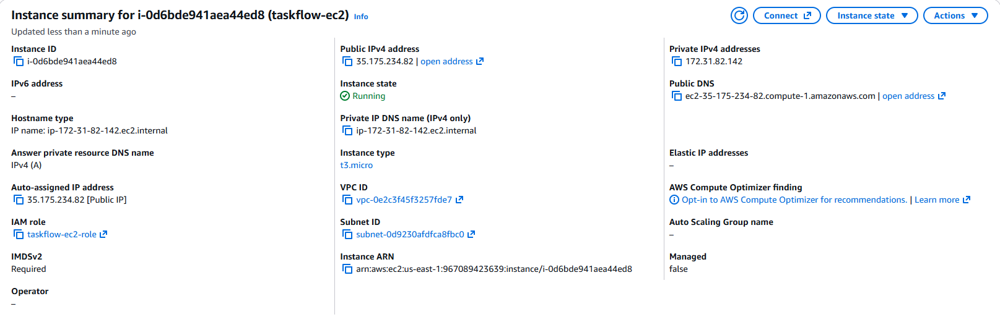

Si damos click en la pestaña Security de la instancia, se observa el security group que creamos (`taskflow-ec2-sg`) y sus respectivas reglas.

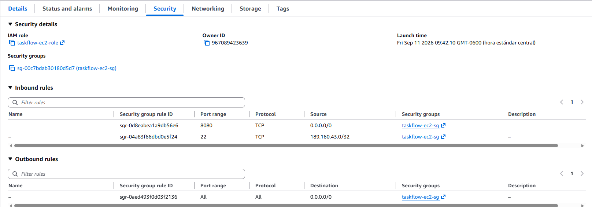

## Conectar por SSH
Desde la carpeta donde guardamos el archivo .pem se ejecutan los siguientes comandos: 

```
chmod 400 taskflow-key.pem
```
Este comando cambia los permisos del archivo para que solo el dueño pueda leerlo (mediante el usuario del sistema operativo) y nadie pueda escribirlo o ejecutarlo.

```
ssh -i taskflow-key.pem ec2-user@<TU-IP>
```
Este comando es el que realiza la conexión a la instancia EC2, se tiene que remplazar "TU-IP" por la IPv4 address que aparece en los detalles de la instancia.

Una vez dentro de la instancia, podemos ejecutar los siguientes comandos para asegurarnos que todo funciona correctamente:

```
uname -a
```
Muestra información del kernel y sistema operativo.

```
curl ifconfig.me
```
Devuelve la IP pública.
```
free -m 
```
Muestra el uso de memoria RAM, en megabytes.

## Instalar Java en la instancia EC2
Para instalar Java en nuestra instancia, usamos el comando:
```
sudo dnf install -y java-21-amazon-corretto-headless
```
Para verificar la correcta instalación de Java podemos usar el comando:
```
java -version
```
Si obtenemos un mensaje que contenga algo como: openjdk version "21.0.12.1", entonces se confirma que la instalación fue exitosa.

## Copiar el .jar de `taskflow-api` a la instancia de EC2
Primero tenemos que compilar el proyecto localmente con el comando: 
```
mvn -q -DskipTests package
```
Con -DskipTests nos saltamos la ejecución de los tests unitarios durante el build. Como resultado se genera un archivo .jar.

Despues, necesitamos copiar el archivo .jar hacia la instancia EC2, mediante SSH:
```
scp -i <ruta-a-tu>/taskflow-key.pem target/taskflow-api-*.jar ec2-user@<TU-IP>:~/taskflow-api.jar
```
En el comando se especifica la ruta donde guardamos el archivo .pem , los archivos .jar que queremos subir a EC2 y el usuario ec2-user con la IP pública de la instancia y la ruta `~/taskflow-api.jar`

Para asegurarnos que el mismo archivo que tenemos en la computadora es el que se subio a EC2, podemos ejecutar los comandos: 
```
shasum -a 256 target/taskflow-api-*.jar
```
Se ejecuta en la computadora.
```
sha256sum ~/taskflow-api.jar 
```
Se ejecuta en la instancia EC2.

Se producen dos hashes que deben ser idénticos. Asi es como sabemos que es el mismo archivo, no se recompiló nada.

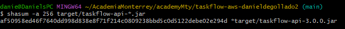
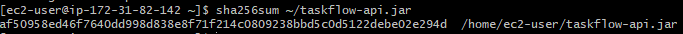

## Primer arranque público
Para correr la aplicación, se usaron los siguientes comandos:
```
nohup java -jar taskflow-api.jar > app.log 2>&1 &
```
Ejecuta la aplicación Spring Boot que fue empaquetada como jar ejecutable y guarda los logs en un archivo llamado `app.log`, retorna el Process ID del proceso que queda corriendo en segundo plano.

```
tail -f app.log
```
Muestra en tiempo real el contenido del archivo `app.log` en tiempo real. Tenemos que esperar a que aparezca `Started TaskflowApiApplication`. Una vez que aparezca ya se puede abrir el swagger de la aplicación y ejecutar los endpoints definidos.
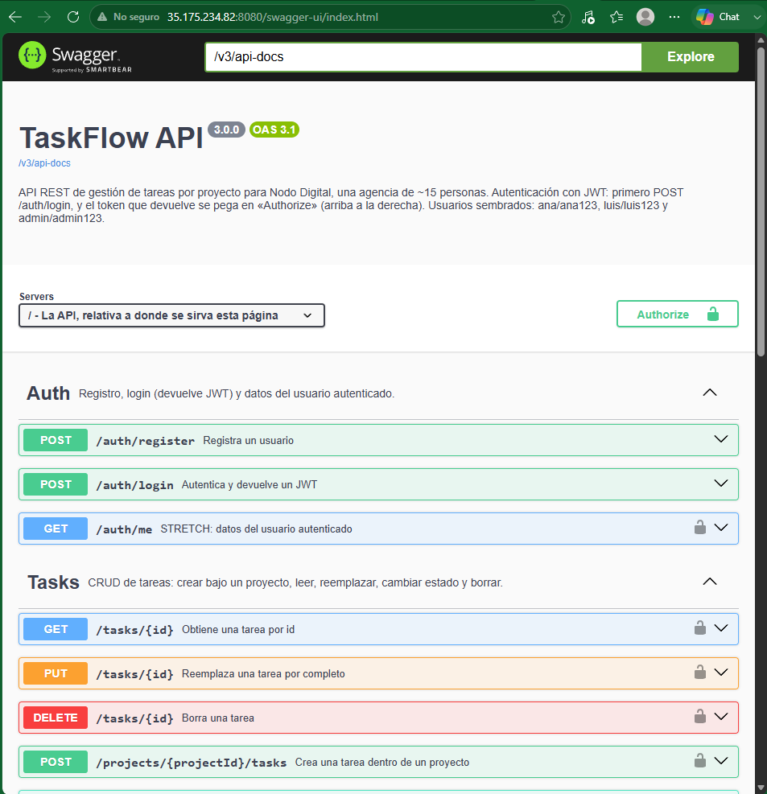

## Crear base de datos RDS 
Hasta este momento estabamos utilizando una base de datos embebida que corría dentro de la misma JVM, ahora creamos una base de datos RDS para que la información de las tasks viva ahi.
Para crear una base de datos RDS se tiene que seguir el camino: Barra de búsqueda → RDS → menú izquierdo Databases → el botón naranja Create database y elegir Full configuration.

La configuración de la base de datos es la siguiente: 
- Engine options: PostgreSQL
- Choose a database creation method: Full configuration
- Templates: Free tier
- Availability and durability: Single-AZ DB instance deployment (1 instance). Para este proyecto no existira redundancia de la información, vivira en una sola instancia.
- Settings: Engine version PostgreSQL 18.3-R2
- Credentials Settings: Se definió el master username y master password para acceder a la base de datos.
- Instance configuration: Burstable classes (includes t classes)
- Storage: General Purpose SSD (gp3) con una capacidad minima de almacenamiento de 20GB, se desactiva Enable storage autoscaling para que la capacidad de almacenamiento no aumente incluso despues de que se excedio la cantidad especificada.
- Connectivity: Don't connect to an EC2 compute resource, se deniega el acceso publico y se crea un nuevo VPC security group con el nombre `taskflow-rds-sg`
- Additional credentials settings (dentro de Credentials Settings): Password authentication
Additional configuration: Initial database name: taskflow

Al crearse la base de datos, podemos entrar a ver sus detalles.
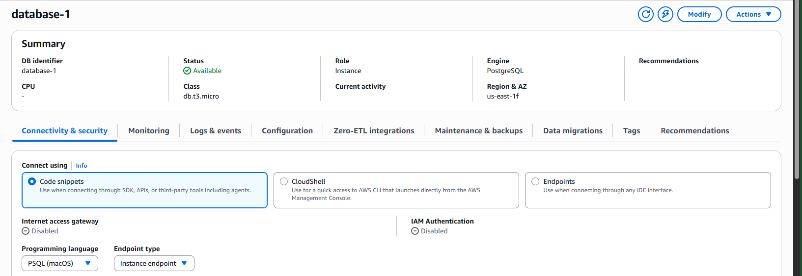

Se puede observar que la base de datos RDS no tiene un IP pública, esto esta definido asi para que no pueda recibir tráfico desde internet, ya que eso haría que fuera un blanco de todo tipo de ataques. Nuestra instancia EC2 puede acceder a la base de datos gracias a que viven dentro de la misma VPC (Virtual Private Cloud), es básicamente una red privada dentro de AWS. Gracias a esto, la instancia EC2 y la base de datos RDS pueden comunicarse entre sí usando sus IPs privadas.

## S3 Bucket
Para crear un bucket, podemos seguir la ruta: Barra de búsqueda → S3 → Create bucket.

Configuración del bucket:
- Bucket type: General purpose.
- Bucket namespace: Global namespace.
- Bucket name: taskflow-artefacto-danieldegollado2. 
- Block Public Access settings: Block all public access.

Una vez creado el bucket, subimos el archivo .jar que se genero al compilar el proyecto localmente.

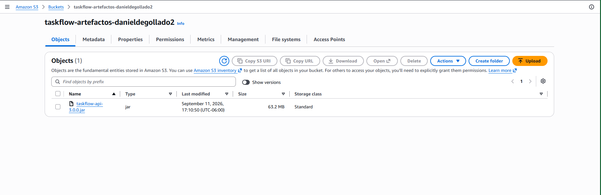

Si tratamos de acceder a la Object URL del bucket (ubicado en la ruta: click al nombre del jar → pestaña Properties → bloque Object overview → Object URL.), nos regresara un XML con el mensaje `AccessDenied`, esto quiere decir que el bucket es privado.

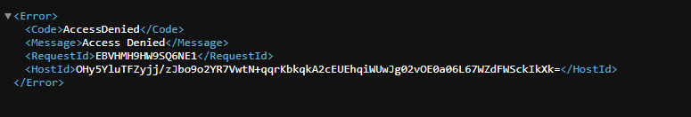

Para tener acceso al .jar podemos crear un presigned URL, el cual es una url que tiene un tiempo de duración que nosotros definimos. Al pegar la url en una pestaña nueva, automáticamente se descarga el jar.

## Conectar la API al RDS
Primero tenemos que generar un secreto JWT, ya que el perfil docker al que vamos a cambiar lo solicita al leer `${JWT_SECRET}`. Podemos generar el secreto con el siguiente comando:
```
openssl rand -hex 32 
```
Se imprimen 64 caracteres hexadecimales, esto se tiene que copiar y guardar en algun otro lugar seguro.

Una vez tenemos el secreto JWT, podemos ejecutar el siguiente comando para hacer la conexión de la instancia EC2 con la base de datos RDS.
```
nohup java -jar taskflow-api.jar \
  --spring.profiles.active=docker \
  --DB_HOST=<endpoint-rds> --DB_PORT=5432 --DB_NAME=taskflow \
  --DB_USER=taskflow --DB_PASSWORD='<la tuya>' \
  --JWT_SECRET='<64 caracteres NUEVOS, no los de dev>' \
  > app.log 2>&1 &
```
Lo que este comando hace es, primero cambiar el spring profile activo a `docker` (el perfil se llama asi, no tiene nada que ver con docker) porque anteriormente estabamos usando el profile `h2` para usar H2 como base de datos en memoria. El perfil `docker` utiliza postgresql. Ademas puede configurar diferentes atributos, como el host, name, user, password y jwt secret (los 64 carácteres hexadecimales generados anteriormente).

Al ejecutar el comando me sale el siguiente error: 

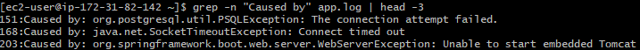

Es un error de red `timed out`: el paquete no recibe respuesta porque el Security Group de RDS no tiene una regla que permita el tráfico entrante desde la EC2, así que lo descarta silenciosamente. Se soluciona agregando una regla inbound en el Security Group del RDS: tipo PostgreSQL (puerto 5432), y como origen el Security Group de la EC2.

Hay que ir a la ruta: EC2 → menú izquierdo, bloque Network & Security → Security Groups → click a taskflow-rds-sg (RDS creo este security group) → pestaña Inbound rules → Edit inbound rules → Add rule:

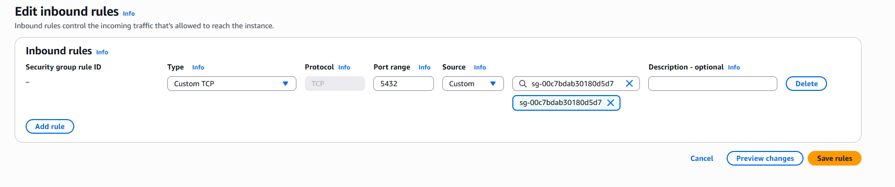

Esta inbound rule le dice al Security Group de RDS que acepte tráfico entrante en el puerto
5432 (PostgreSQL) proveniente de cualquier instancia que tenga asignado el Security Group
de la EC2.

Ahora la aplicación funciona sin ningun problema. El .jar está desplegado y corriendo en la instancia EC2, la cual se comunica con la base de datos RDS por IP privada dentro de la misma VPC, gracias a la inbound rule del Security Group de RDS que permite tráfico en el puerto 5432 desde el Security Group de la EC2.

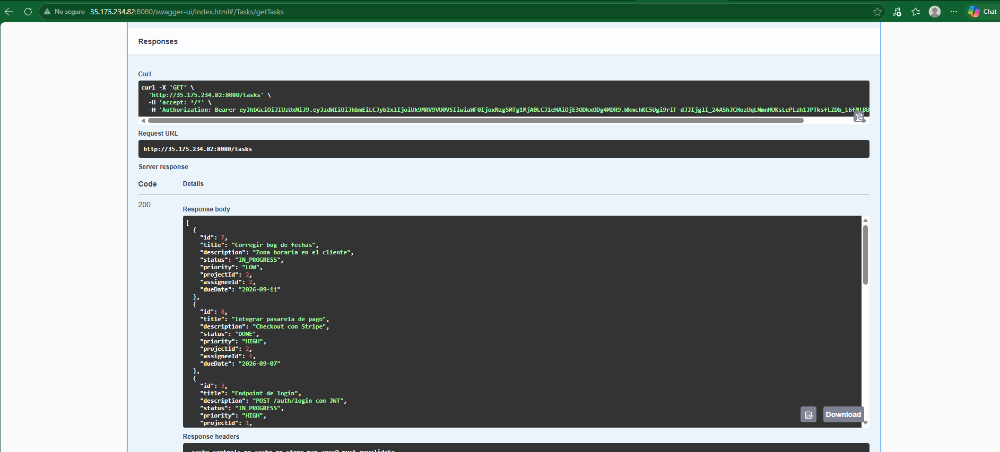

## Integrador y limpieza

### Smoke test
Ya con la aplicación TaskFlow en AWS, haremos una prueba básica para verificar que uno de los endpoints funcione correctamente. En este caso probaremos el endpoint `tasks`.

Primero tenemos que hacer login, se utilizara el usuario de ana.

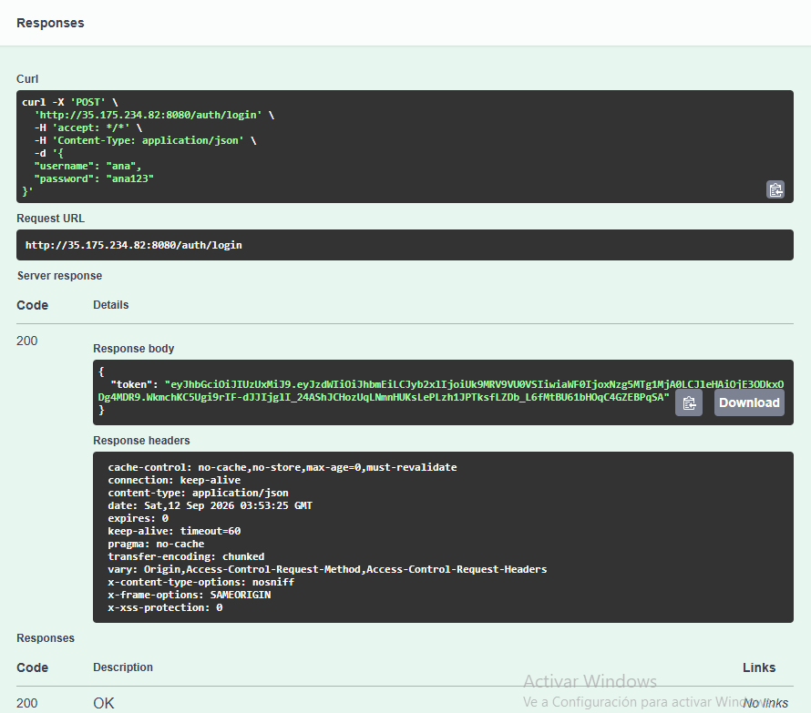

La API nos regresa un token, que usaremos para recibir autorización para llamar a los metodos `GET` y `POST` del endpoint `tasks`.

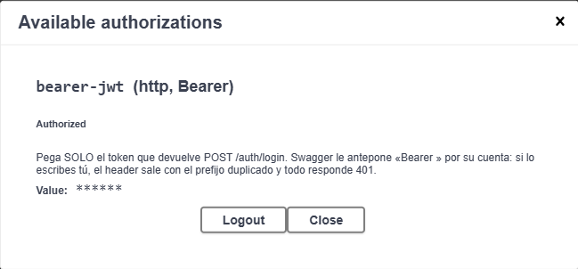

`POST` de una tarea.

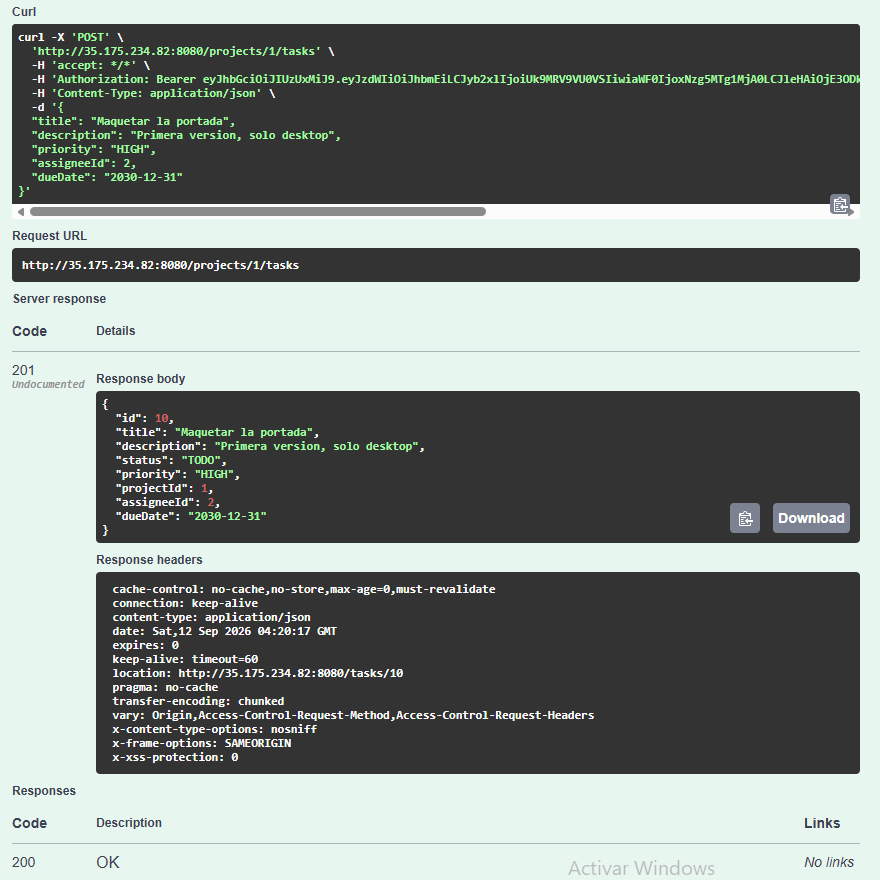

`GET` de esa tarea.

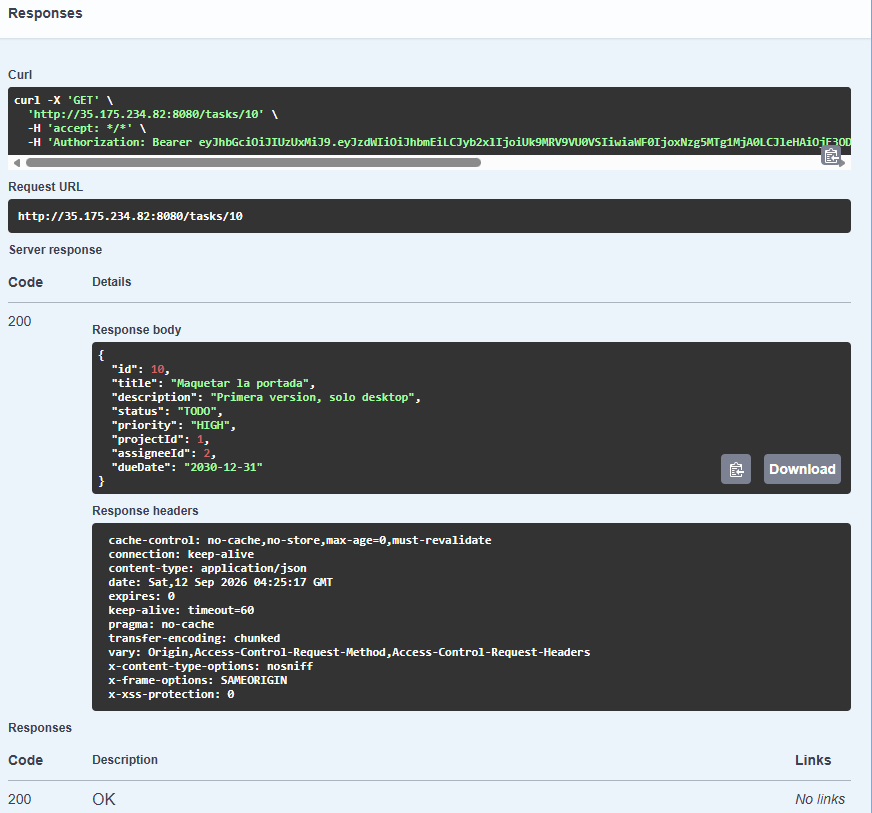


### Topologia
| Recurso | Identificador / Valor |
|---|---|
| Región | `us-east-1` |
| EC2 — Instance ID | `i-0d6bde941aea44ed8` |
| EC2 — Nombre | `taskflow-ec2` |
| EC2 — Security Group | `taskflow-ec2-sg` |
| RDS — Endpoint (ofuscado) | `database-1.XXXXXXXXXXXX.us-east-1.rds.amazonaws.com` |
| RDS — Puerto | `5432` |
| RDS — Security Group | `taskflow-rds-sg` |
| S3 — Bucket | `taskflow-XXXXXXXXXX` |

### Limpieza
 
Despues de terminar este proyecto de prueba, conviene borrar todos los recursos que ya no vayan a ser necesarios.

- Instancia EC2 borrada

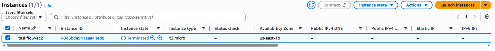

- Base de datos RDS borrada

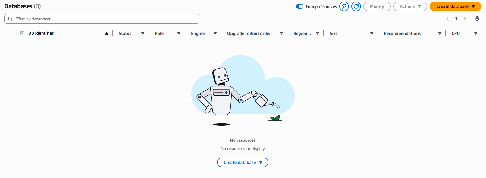

- Vaciar bucket

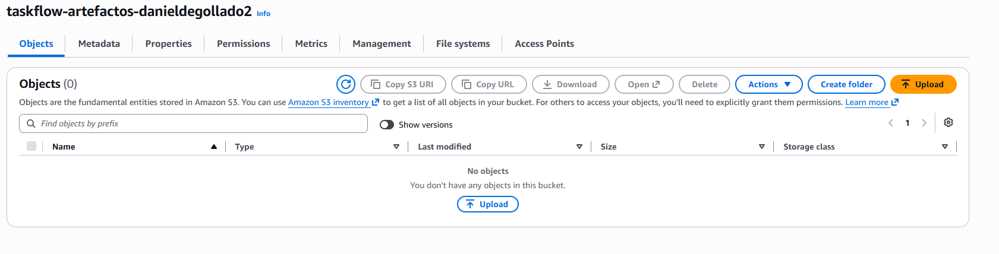

- Borrar keypairs

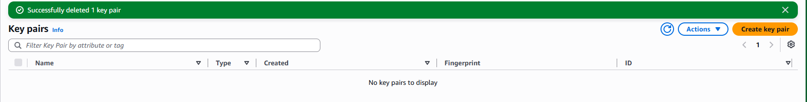

- Borrar security groups de EC2 y RDS

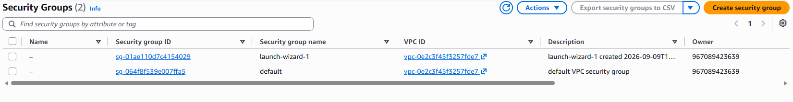

# AWS: DynamoDB, CodePipeline y CodeDeploy

## Objetivo
En el proyecto pasado, se ejecutaron muchos comandos para poder poner la app de TaskFlow en AWS, en este proyecto se escriben solo una vez como scripts. Solo sera necesario hacer un `git push` y ver como la aplicación se despliega sola.

## Relanzar la EC2
La instancia EC2 que se destruyo en el proyecto pasado se volverá a crear en este con dos cosas nuevas: IAM instance profile y Tag Name = taskflow-ec2.

Creamos un rol para la EC2.

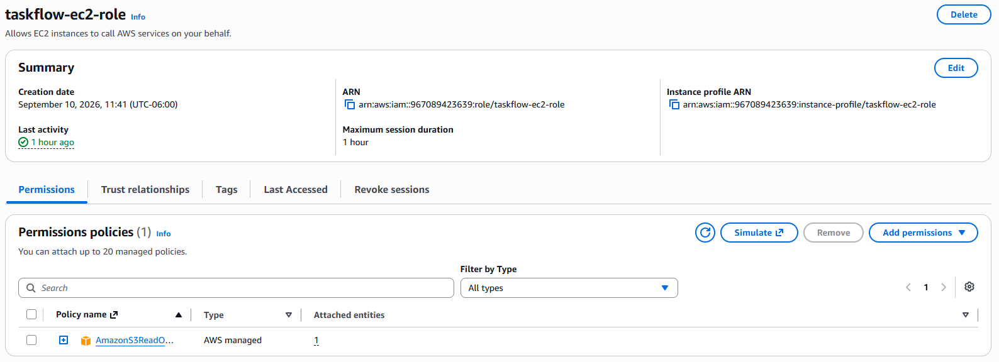

El rol `taskflow-ec2-role` tiene un permission policy `AmazonS3ReadOnlyAccess`, con este permiso el agente de CodeDeploy que corre dentro de la instancia puede leer el artefacto del bucket.

Para crear la instancia EC2 se sigue la misma ruta: EC2 → Instances → Launch instances.

Configuración (La misma que el proyecto pasado, con algunas diferencias):
- Name and tags: Name: `taskflow-ec2`. Es el nombre de la instancia.
- Application and OS Images (Amazon Machine Image): Amazon Linux 2023 AMI. Una AMI contiene el sistema operativo, servidor de aplicaciones y aplicaciones que usara la instancia.
- Instance type: `t3.micro`. Es la maquina donde correra la instancia, en este caso elegimos la más basica.
- Key pair (login): Se crea un archivo `.pem` que nos servira como llave privada SSH, permite que nos conectemos de forma segura a la instancia EC2 mediante SSH. Crea una llave pública que AWS guarda e instala automáticamente en la instancia EC2 y una llave privada (.pem) que se descarga en la computadora personal.
- Security group: Ahora creamos un security group desde que creamos la instancia EC2. Es el security group `taskflow-ec2-sg`, el puerto 22 solo puede acceder `My Ip` para SSH y el puerto 8080 esta abierto `0.0.0.0/0`.
- IAM instance profile: Se elige el rol `taskflow-ec2-role` creado previamente.

La nueva instancia EC2 es creada correctamente.

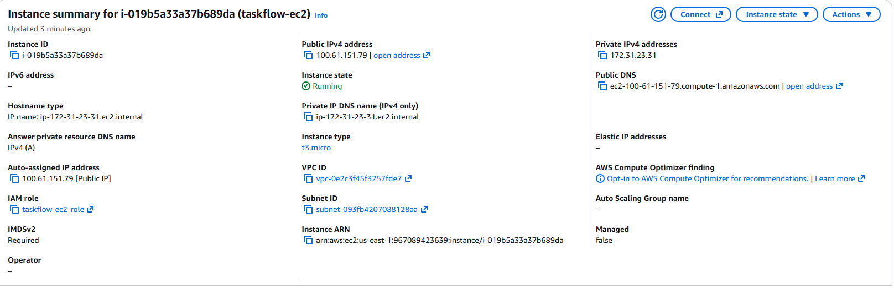

Como es una nueva instancia, la `Public IPv4 address` es diferente. Para entrar por SSH a la instancia volvemos a utilizar el comando:

```
ssh -i taskflow-key.pem ec2-user@100.61.151.79
```
Como esta instancia es nueva y esta vacia, tenemos que volver a instalar Java 21.
```
sudo dnf install -y java-21-amazon-corretto-headless
```
Esta vez no se subira el .jar con un comando, el responsable de subirlo a la instancia es el pipeline.

## DynamoDB
En el proyecto pasado se utilizaron las bases de datos H2 y PostgreSQL, esta vez se utilizara `DynamoDB`. Es una base de datos `NoSQL` que trabaja con un modelo de clave-valor gestionado.
Esta base de datos utiliza dos claves principales: Partition key que decide en que servidor físico vive el dato y Sort key que ordena lo que hay dentro de esa partición.

Utilizando `AWS CLI` configurada con el usuario IAM `taskflow-admin` creado anteriormente, se creara una nueva tabla, insertaremos y leeremos datos.

Para crear una nueva tabla se ejecuta el comando:
```bash
aws dynamodb create-table \
  --table-name taskflow-eventos \
  --attribute-definitions \
      AttributeName=taskId,AttributeType=S \
      AttributeName=fechaHora,AttributeType=S \
  --key-schema \
      AttributeName=taskId,KeyType=HASH \
      AttributeName=fechaHora,KeyType=RANGE \
  --billing-mode PAY_PER_REQUEST
```
Se definen los atributos taskId y fechaHora. El atributo taskId tiene un KeyType `HASH`, esto significa que será la Partition Key que decide en que servidor vive el dato, el atributo fechaHora tiene un KeyType `RANGE` porque es la Sort Key que ordena lo que hay dentro de esa partición.

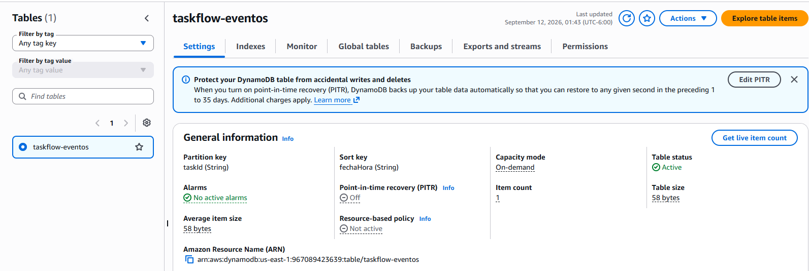

Para crear un evento se ejecuta el comando:

```bash
aws dynamodb put-item --table-name taskflow-eventos --item '{
  "taskId":    {"S": "T-001"},
  "fechaHora": {"S": "2026-09-08T09:15:00Z"},
  "tipo":      {"S": "CREADA"},
  "autor":     {"S": "ana"}
}'
```
Cada valor lleva su tipo `"S"`, este es básicamente el equivalente a String.

Se agregan mas items. 

```bash
aws dynamodb put-item --table-name taskflow-eventos --item '{"taskId":{"S":"T-001"},"fechaHora":{"S":"2026-09-08T10:02:00Z"},"tipo":{"S":"ASIGNADA"},"autor":{"S":"admin"},"detalle":{"S":"asignada a luis"}}'
aws dynamodb put-item --table-name taskflow-eventos --item '{"taskId":{"S":"T-001"},"fechaHora":{"S":"2026-09-08T11:40:00Z"},"tipo":{"S":"EN_PROGRESO"},"autor":{"S":"luis"}}'
aws dynamodb put-item --table-name taskflow-eventos --item '{"taskId":{"S":"T-002"},"fechaHora":{"S":"2026-09-08T09:30:00Z"},"tipo":{"S":"CREADA"},"autor":{"S":"luis"},"detalle":{"S":"Revisar el contrato de la API"}}'
aws dynamodb put-item --table-name taskflow-eventos --item '{"taskId":{"S":"T-002"},"fechaHora":{"S":"2026-09-08T16:05:00Z"},"tipo":{"S":"COMPLETADA"},"autor":{"S":"luis"}}'
```

Asi se ven todos los items creados desde la consola.

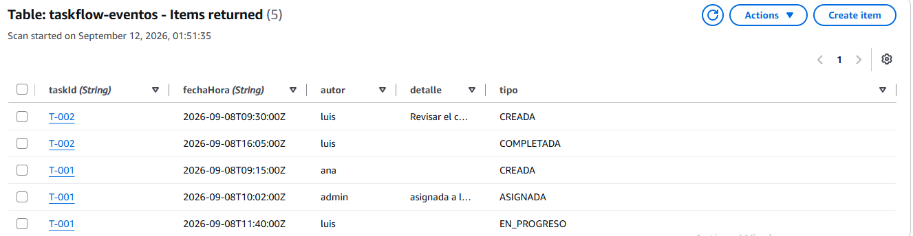

Para obtener un item por su id, se utiliza el comando:

```bash
aws dynamodb get-item --table-name taskflow-eventos \
  --key '{"taskId":{"S":"T-001"},"fechaHora":{"S":"2026-09-08T09:15:00Z"}}'
```

Devuelve exactamente el evento con la `taskId` proporcionada, si no se proporciona `fechaHora` obtendremos el error `ValidationException: The provided key element does not match the schema`. Es necesario especificar tanto la Partition Key como la Sort Key.

### `Query` contra `Scan`
Si ejecutamos un `query` por `taskId` con `--return-consumed-capacity TOTAL`.

```bash
aws dynamodb query --table-name taskflow-eventos \
  --key-condition-expression "taskId = :t" \
  --expression-attribute-values '{":t":{"S":"T-001"}}' \
  --return-consumed-capacity TOTAL
```

Devuelve como resultado: 

```bash
"Count": 3,
    "ScannedCount": 3,
    "ConsumedCapacity": {
        "TableName": "taskflow-eventos",
        "CapacityUnits": 0.5
    }
```
Devolvió y escaneo 3 eventos de los 5 totales, la razón de esto es que solo lee la partición `T-001` que especificamos en el `query` y regresa 3 eventos ordenados por la `Sort Key` `fechaHora`.

Ahora, para realizar un `scan` se ejecuta el comando:

```bash
aws dynamodb scan --table-name taskflow-eventos \
  --filter-expression "tipo = :x" \
  --expression-attribute-values '{":x":{"S":"COMPLETADA"}}' \
  --return-consumed-capacity TOTAL
```

En este comando se busca que nos devuelva los eventos marcados como `COMPLETADA`, el resultado es el siguiente:

```bash
 "Count": 1,
    "ScannedCount": 5,
    "ConsumedCapacity": {
        "TableName": "taskflow-eventos",
        "CapacityUnits": 2.0
    }
```

Solo devolvió 1 evento completado pero escaneo 5 en total. 

En esta comparación queda claro cual es el funcionamiento y en que se diferencian `query` y `scan`. Un `query` solo lee lo correspondiente a una partición, mientras que `scan` lee la tabla entera. En cuanto a la forma de filtrar la información, `query` lo hace al leer, por clave y `scan` filtra despues de haber leído toda la tabla.
Tambien hay una gran diferencia en el costo que tiene cada uno. Mientras mas elementos haya en una tabla, el costo de `scan` aumenta, el costo de `query` depende de los elementos de una partición (que deberían ser menos que los elementos totales en la tabla).

Si se quiere hacer una busqueda, es mas recomendable utilizar `query`. En DynamoDB `scan` es una herramienta de
mantenimiento y de exportación, no de consulta.

### Modelar al revés
En SQL se modelan las entidades y después las consultamos como queramos. DynamoDB hace este proceso al revés: Primero se escribe la lista de preguntas que va a hacer la aplicación y definimos la tabla en base a esa lista.

Tomando como referencia la tabla de eventos, podemos definir las preguntas de lo que puede hacer la aplicación:

| # | Necesito… | ¿Se puede con una tabla `taskflow-eventos`? | Clave que lo sirve |
|---|---|---|---|
| 1 | el historial completo de una tarea, en orden cronológico | Sí | `query` con `taskId = :t`. La sort key `fechaHora` lo devuelve ordenado: no hay que ordenar nada después |
| 2 | el último evento de una tarea | Sí | el mismo `query` con `--no-scan-index-forward --max-items 1`: lee la partición al revés y para en el primero. No lee el resto |
| 3 | los eventos de una tarea a partir de una fecha | Sí | `query` con `taskId = :t AND fechaHora >= :desde`. Para necesidades como esta es porque existe la `SortKey` |
| 4 | todas las tareas que completó luis este mes | NO | ninguna. `autor` y `tipo` no son parte de la clave |

Como se observa, una de las necesidades no es posible con la tabla `taskflow-eventos`, ya que DynamoDB solo puede buscar por clave, `autor` y `tipo` no son parte de esta.
Una posible solución es crear un indice secundario global con `autor` como partition key y `fechaHora` como sort key. Aunque una solución asi costaría almacenamiento y escrituras aparte, es por eso que es necesario anticipar todos los patrones de acceso de la aplicación.

## El pipeline
Para el pipeline se definierón cuatro archivos (`buildspec.yml`, `appspec.yml`, `taskflow.service` y los `scripts/*.sh`), cada uno sera leído por una máquina distinta, sin necesidad de escribir comandos. 

### Que hace cada pieza del pipeline
- PC: Es desde donde haremos modificaciones a la aplicación Spring Boot taskflow-api, cuando tengamos todos los cambios listos se hace un `git push` al repo de Github.
- Github: Al detectar cambios, le avisa al CodePipeline para que este encienda la cadena.
- CodePipeline: Es el orquestador del flujo. Recibe un aviso de GitHub cuando hay un cambio de código, y coordina automáticamente las etapas: invoca a CodeBuild para compilar la aplicación Spring Boot (generando un .zip), almacena el artefacto en un bucket S3, y luego ejecuta el despliegue de la aplicación con CodeDeploy.
- CodeBuild: el agente de CodeBuild lee el archivo `buildspec.yml`, va a la raíz del repositorio donde vive taskflow-api y construye el artefacto (archivo .zip). Este artefacto se sube al bucket S3.
- Bucket S3: guarda el artefacto, el cual contiene un archivo .jar, el archivo `appspec.yml`, el archivo `taskflow.service`, y la carpeta `scripts/`. CodeDeploy descarga el .zip desde el bucket.
- CodeDeploy: Descarga el artefacto guardado en el bucket S3. Pertenece a un grupo de despliegue, el cual esta configurado para buscar automáticamente que instancia EC2 es el destino del despliegue, usando un tag (en este caso es el tag que se le coloco a la instancia EC2 `taskflow-ec2`). CodeDeploy le manda el artefacto al CodeDeploy Agent de esa instancia EC2. Es importante que el archivo `appspec.yml` viaje dentro del artefacto, porque el CodeDeploy Agent lo lee dentro de la instancia EC2, para saber que archivos copiar y que scripts correr, en que orden.

### Hooks
Dentro del archivo `appspec.yml` hay una sección donde se especifican diferentes hooks: `ApplicationStop`, `AfterInstall`, `ApplicationStart` y `ValidateService`, dentro de ellos viven los comandos que se utiizaron el proyecto pasado para colocar taskflow-api en AWS de manera manual.

| Comendo | Hoy vive en… | Hook |
|---|---|---|
| `mvn -q -DskipTests package` | `buildspec.yml` → `phases.build` | lo corre CodeBuild, no CodeDeploy |
| `scp … taskflow-api.jar ec2-user@IP:~` | `appspec.yml` → `files` (source → destination) | la copia la hace el agente antes de `AfterInstall` |
| El proceso se mataba con `kill` | `scripts/parar.sh` → `systemctl stop taskflow \|\| true` | `ApplicationStop` |
| `chown` / permisos del jar | `scripts/permisos.sh` → `chown -R ec2-user …` + `daemon-reload` + `enable` | `AfterInstall` |
| `nohup java -jar … &` | `scripts/arrancar.sh` → `systemctl start taskflow` (y `taskflow.service` con el `ExecStart`) | `ApplicationStart` |
| abrir el navegador a ver si respondía | `scripts/verificar.sh` → `curl` a `/info` con reintentos | `ValidateService` |

### Bucket de artefactos
Se crea un bucket S3 con `Bucket Versioning` activado. Para crearlo hay que seguir la ruta: S3 → Create bucket.

Configuración del bucket.
- Bucket type: General purpose.
- Bucket namespace: Global namespace.
- Bucket name: taskflow-artefacto-danieldegollado2. 
- Block Public Access settings: Block all public access.
- Bucket Versioning: Activado.

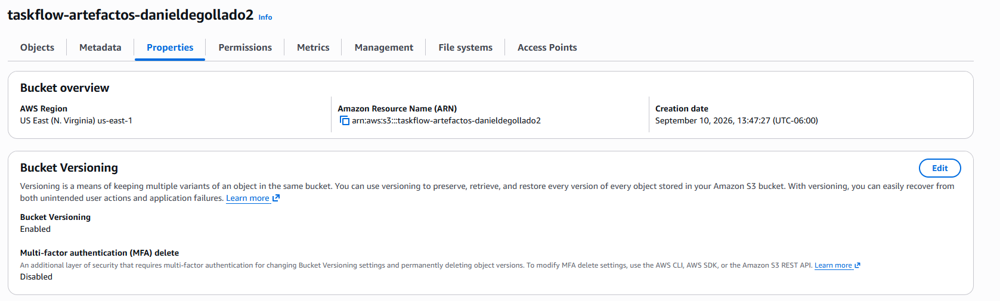

### Agente de CodeDeploy
El agente tiene que instalarse dentro de la EC2, mediante SSH.

```bash
ssh -i taskflow-key.pem ec2-user@<IP nueva>
```

Para instalar el agente, se usan los comandos:

```bash
sudo dnf install -y ruby wget
cd /home/ec2-user
REGION=us-east-1        # ← us-east-2 si tu cuenta es de la experiencia nueva (Ohio)
wget https://aws-codedeploy-$REGION.s3.$REGION.amazonaws.com/latest/install
head -1 install         # tiene que decir: #!/usr/bin/env ruby
chmod +x ./install
sudo ./install auto
sudo systemctl status codedeploy-agent
```

Cuando el agente se instala con exito, se observa el siguiente mensaje: 

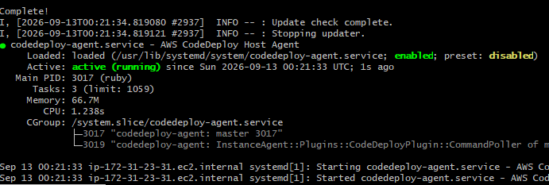

El agente se queda esperando órdenes, CodeDeploy le entrega el archivo `appspec.yml` para que lo lea.

### taskflow.service
Este archivo define varias directivas, las principales son:
- `WorkingDirectory=/opt/taskflow`: H2 escribe en ./data relativo a esto. Es donde el `appspec.yml` deja el jar. 
- `SuccessExitStatus=143`: Sin esta linea, `systemctl stop` deja al servicio marcado como `failed`. Ahora Spring Boot sale con 143 cuando es detenido por `systemd`.
- `Restart=always`: `systemd` levanta el proceso si llega a morir.
- `User=ec2-user`: Es el mismo usuario por el que se entra mediante SSH, `permisos.sh` hace
el chown de /opt/taskflow a ec2-user.

### buildspec.yml
El archivo contiene lo siguiente:
- Runtime: CodeBuild no acepta solamente 21, el runtime es corretto21.
- Nombre del jar: Maven genera `taskflow-api-3.0.0.jar`, `post_build` lo renombra a `target/taskflow-api.jar` porque el archivo `appspec.yml` no admite comodines en `files.source`.

### appsec.yml
Como se menciono anteriormente, `appsec.yml` contiene hooks que reemplazan los comandos manuales para levantar la aplicación en AWS.

- `kill <PID>` se reemplaza por el script `parar.sh` del hook `ApplicationStop.`
- `chown / permisos` se reemplaza por el script `permisos.sh` del hook `AfterInstall.`
- `nohup java -jar … &` se reemplaza por el script `arrancar.sh` del hook `ApplicationStart`
- Esto no es un comando pero abrir el navegador para ver si la aplicación respondía se reemplaza por el script `verificar.sh` del hook `ValidateService.`

### Cablear el pipeline
Primero debemos crear el rol de CodeDeploy, ruta: IAM → Roles → Create role. ´

Configuracion del rol de CodeDeploy:
- `Trusted entity type`: AWS service.
- `Use case`: CodeDeploy.
- `Permission policies`: AWSCodeDeployRole
- `Role name`: taskflow-codedeploy-role

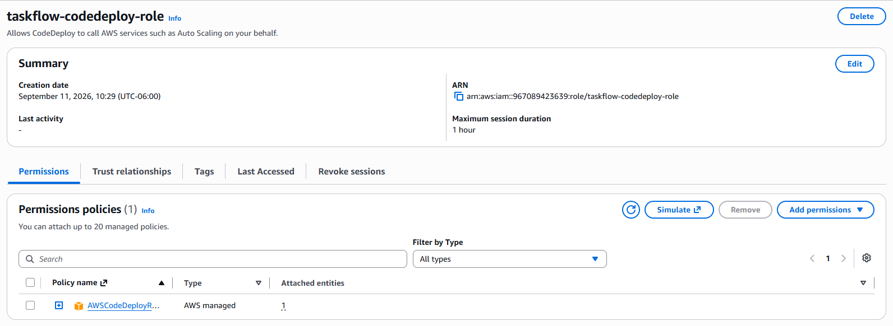

Ahora creamos la aplicación y el grupo de despliegue, ruta: Barra de búsqueda → CodeDeploy → menú izquierdo Applications → Create application.

Configuración aplicación
- `Application name`: taskflow
- `Compute platform`: EC2/On-premises

Configuración grupo de despliegue
- `Deployment group name`: taskflow-dg
- `Service role`: taskflow-codedeploy-role
- `Deployment type`: In-place
- `Environment configuration`: Amazon EC2 instances. En Tag group 1: Key = `Name`, `Value` = taskflow-ec2
- `Agent configuration with AWS Systems Manager`: Never
- `Deployment settings`: CodeDeployDefault.AllAtOnce
- `Load balancer`: Desactivado

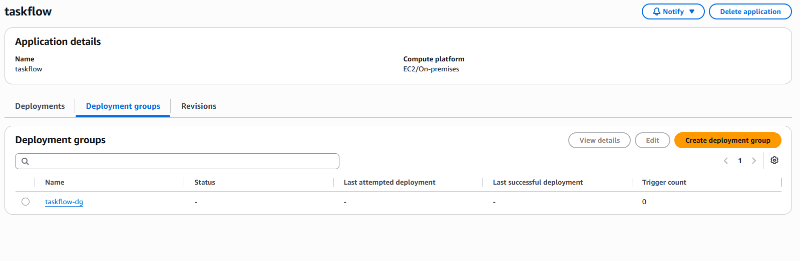

Ahora creamos el pipeline, ruta: Barra de búsqueda → CodePipeline → Pipelines → Create pipeline.

Estos fueron los pasos que se siguieron para la creación del pipeline:
1. Choose creation option: se elige `Build custom pipeline` en vez de la plantilla `Push to ECR`.
2. Pipeline settings: nombre `taskflow-pipeline`, service role nuevo, artifact store en bucket `taskflow-artefactos-#####`.
3. Source stage: conecta el repo de GitHub (`#####/taskflow-aws-#####`, rama `main`) vía GitHub App, con webhook para disparar en cada push.
4. Build stage: usa AWS CodeBuild, creando un nuevo proyecto (`taskflow-build`) con imagen Amazon Linux estándar y `buildspec.yml` del repo.
5. Test stage: se omite (`Skip test stage`).
6. Deploy stage: AWS CodeDeploy, aplicación `taskflow`, grupo `taskflow-dg`, artifact de entrada `BuildArtifact`.

El primer build no corre:

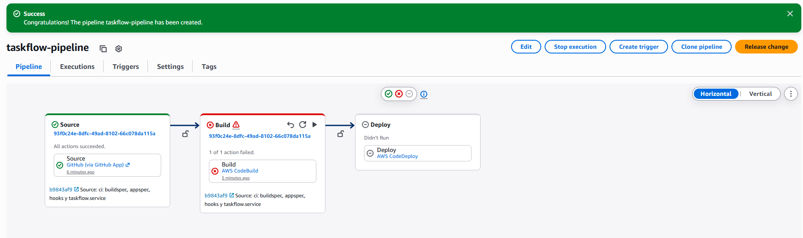

Esto es porque el rol que el asistente le creo a CodeBuild solo sabe leer los buckets que crea AWS. Para arreglarlo hay que ir a la ruta: IAM → Roles → buscar codebuild-taskflow-build-service-role → Add permissions → Attach policies → marcar AmazonS3FullAccess → Add permissions.

Si volvemos al pipeline y le damos click a `Retry stage` en build, veremos que la ejecución fue exitosa. La aplicación taskflow-api esta montada en AWS.

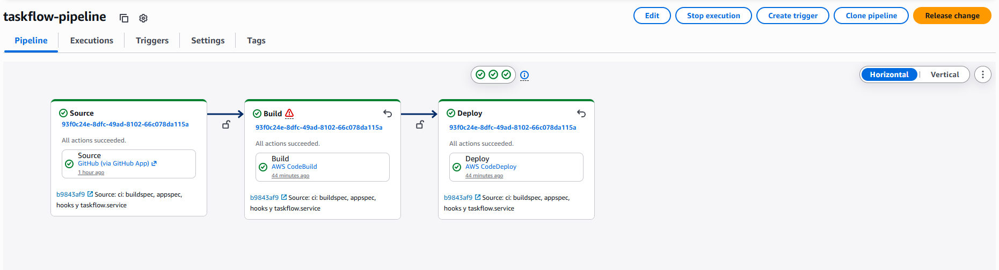

## Integrador — el push que despliega
La aplicación muestra la version 3.0.0, cambiaremos esa version desde el `InfoController` del repo local y haremos un commit y push. De esta forma se mostrará como el pipeline arranca solo despues de un push y ejecuta todo el proceso.

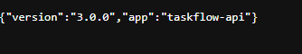

Se modifica la version en el `InfoController` a 3.0.1 y se hace un commit y push.

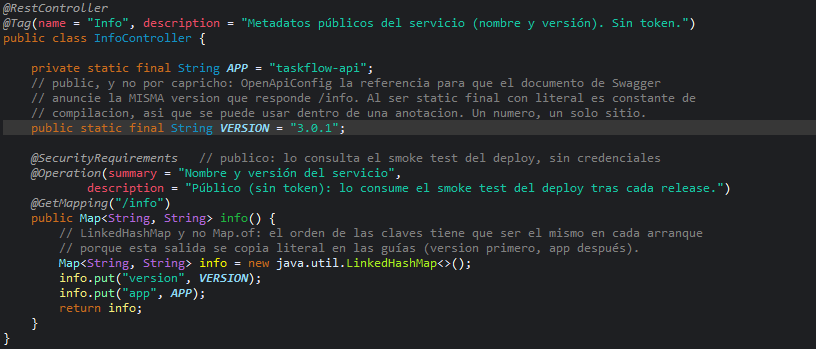

El pipeline se ejecuta correctamente y ahora la aplicación muestra la version 3.0.1.

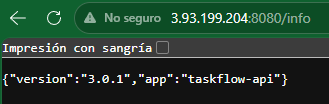

Tambien podemos hacer que el pipeline falle para ver como se comporta. Para mostrarlo se modificará `appspec.yml` cambiando la ruta del hook `AfterInstall` de `location: scripts/permisos.sh` a `location: scripts/no-existe.sh` y hacemos commit y push.

El deploy falla.

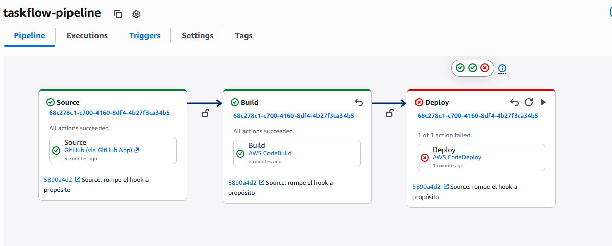

Para ver mas detalles del error podemos ir a la ruta: CodeDeploy → menú izquierdo Deployments → la fila en rojo (Failed) → pulsa su Deployment Id → Deployment lifecycle events → pulsa View events → click en el evento con el status `Failed` → click en el Error code `ScriptMissing`. En la salida del script se puede ver el mensaje:

```
"Script does not exist at specified location: /opt/codedeploy-agent/deployment-root/99a36f46-6f01-44a0-80ba-67c694a6d34c/d-UIKEIODOL/deployment-archive/scripts/no-existe.sh"
```

Que fue justo la ruta que se modificó en el hook `AfterInstall` del archivo `appspec.yml`.

Para arreglar el error simplemente se vuelve a modificar la ruta del hook `AfterInstall` a `location: scripts/permisos.sh`.

El pipeline vuelve a ejecutarse sin problemas.

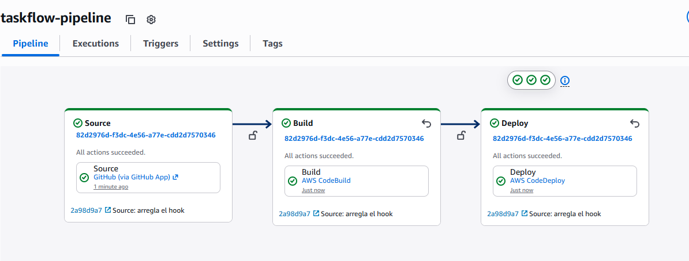

## Limpieza
Despues de terminar el proyecto, se pueden eliminar todos los recursos.

- CodePipeline

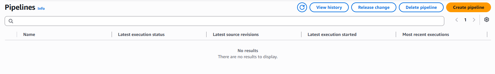

- CodeBuild

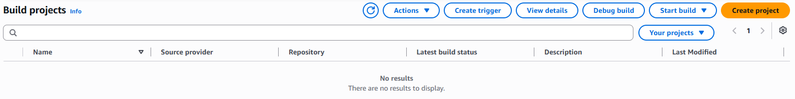

- CodeDeploy

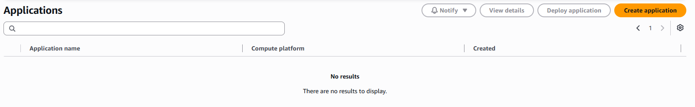

- DynamoDB

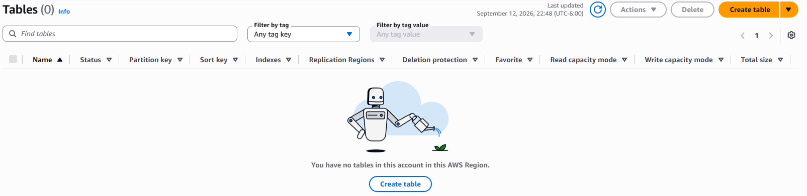

- EC2


- S3

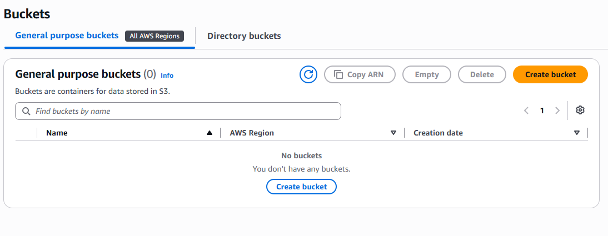

- IAM Roles

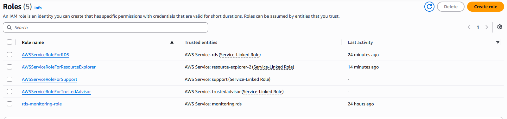

- IAM Users Access Keys

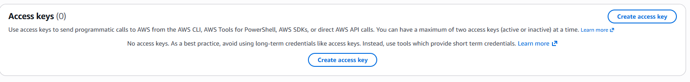

- Key Pairs


- CodePipeline connections

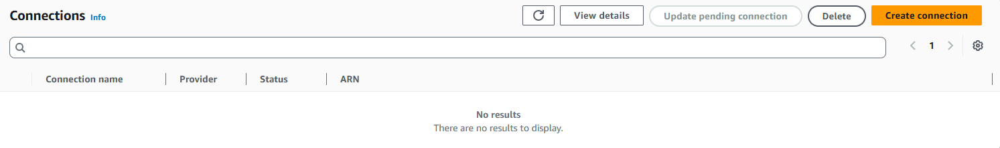